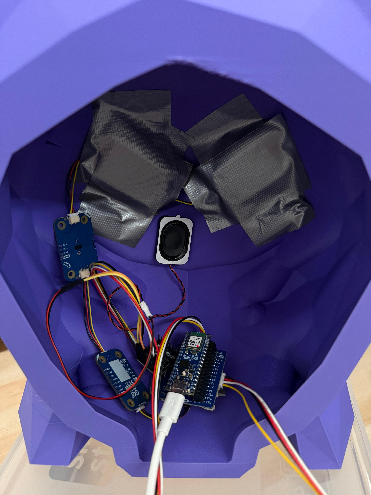
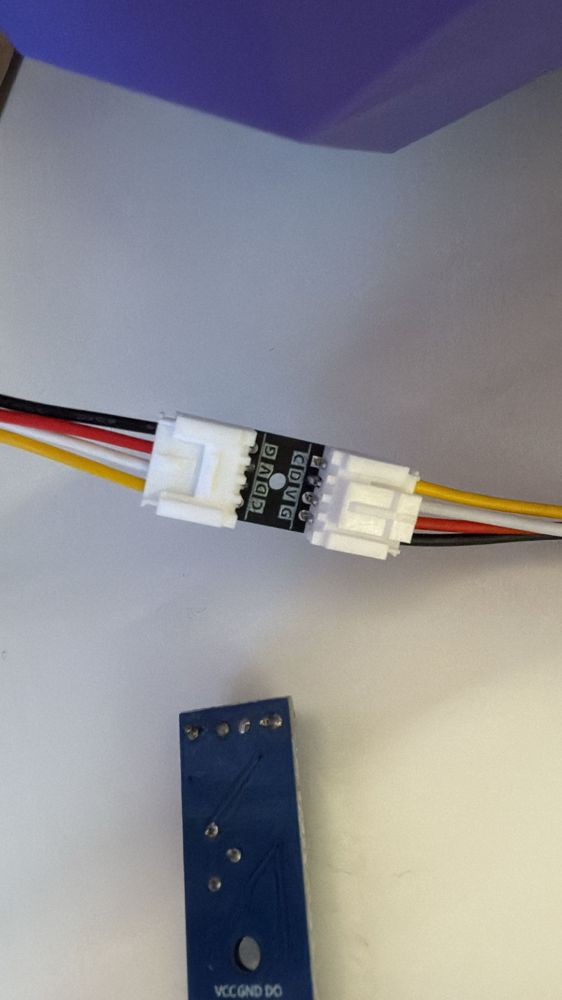

# Our Physical Computing project
This is a project that emulates a Pokémon being catched with the help of various ArduinoBoards.
It connects to xyz to show the output on a display.

## Concept
### How to Play
1) While "Throw 1" is being displayed for 10 seconds, try throwing the Pokéball into the box infront of you.
2) Do the same for Throw 2 and Throw 3.
3) If you manage to throw the Pokéball correctly three times, you win and the Pokémon is caught, if not - the Pokémon escapes.

## Requirements
To build this project you will need:

### Hardware
* [An Arduino Nano ESP32](https://store.arduino.cc/products/nano-esp32-with-headers)
* A Grove RGB LCD Display 16x2
* 2x ModulinoPixels
* USB-C cable
* Speaker
* MP 3 Player
* ArduinoButtons
* [BerryBase SW-420 Vibrationsensormodule](https://www.berrybase.ch/sw-420-vibrationssensor-modul)
* 3D printer
* 3D Filament
* 3x Boxes
* 3x Pokéballs
### Software
* [MicroPython](https://micropython.org/)
* [Arduino Lab for MicroPython](https://labs.arduino.cc/en/labs/micropython)
* [Arduino MicroPython Installer](https://labs.arduino.cc/en/labs/micropython-installer)
* [Autodesk Fusion](https://www.autodesk.com/ch-de/products/fusion-360/overview)
### Libraries
* [MicroPython-Button](https://github.com/ubidefeo/MicroPython-Button)
* [MicroPython I2C 16x2 LCD driver](https://github.com/ubidefeo/micropython-i2c-lcd)
* ...

## How to build
### Wiring

### Uploading the code
* Copy the content of your `src` from your computer to your board
* Install the libraries listed above
* ...
### Feedback and questions
If you are interested in this project and need to ask questions get in touch with us via Github.
