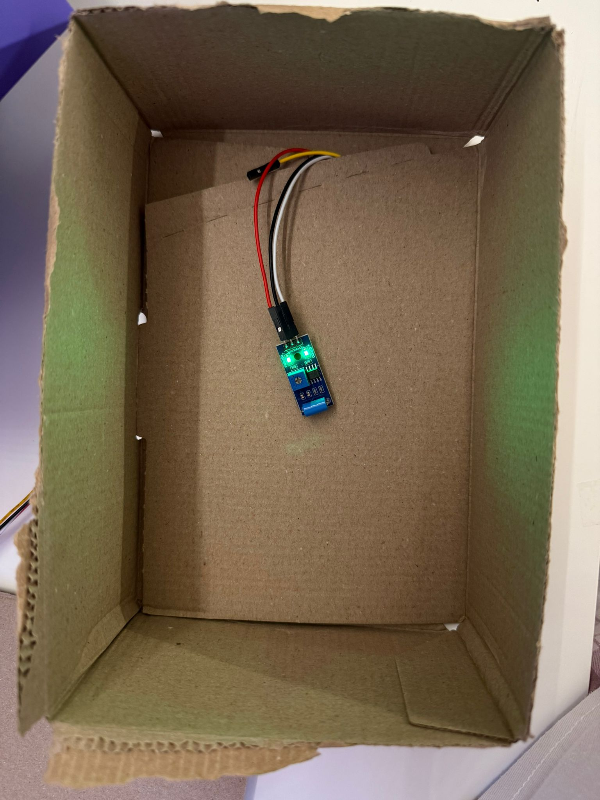

# Our Physical Computing project
This is a project that emulates a Pokémon being catched with the help of various ArduinoBoards.
It connects to xyz to show the output on a display.


## Concept
### How to Play
1) While "Throw 1" is being displayed for 10 seconds, try throwing the Pokéball into the box infront of you.
2) Do the same for Throw 2 and Throw 3.
3) If you manage to throw the Pokéball correctly three times, you win and the Pokémon is caught, if not - the Pokémon escapes.

## Requirements
To build this project you will need:

### Hardware
* [An Arduino Nano ESP32](https://store.arduino.cc/products/nano-esp32-with-headers)
* A Grove RGB LCD Display 16x2
* 2x ModulinoPixels
* USB-C cable
* Speaker
* MP 3 Player
* ArduinoDualButtons
* [BerryBase SW-420 Vibrationsensormodule](https://www.berrybase.ch/sw-420-vibrationssensor-modul)
* 3D printer
* 3D Filament
* 3x Boxes
* 3x Pokéballs
### Software
* [MicroPython](https://micropython.org/)
* [Arduino Lab for MicroPython](https://labs.arduino.cc/en/labs/micropython)
* [Arduino MicroPython Installer](https://labs.arduino.cc/en/labs/micropython-installer)
* [Autodesk Fusion](https://www.autodesk.com/ch-de/products/fusion-360/overview)
### Libraries
* [MicroPython-Button](https://github.com/ubidefeo/MicroPython-Button)
* [MicroPython I2C 16x2 LCD driver](https://github.com/ubidefeo/micropython-i2c-lcd)
* [MicroPython UART]

## How to build
### Wiring
Dual Buttons


LCD Display


Wiring inside of 3D build


Vibrationsensor inside false-bottom box


cable connector


### The code

```
# ============================================================
#   IMPORTS
# ============================================================
from machine import Pin, UART, I2C
from time import sleep, sleep_ms
import time
import random

# LCD
from i2c_lcd import RGBDisplay

# Pixels
from modulino import ModulinoPixels

# MP3
from dfplayer import DFPlayer


# ============================================================
#   LCD INITIALISIEREN  (I2C Bus 1 = SDA17 / SCL18)
# ============================================================
i2c_bus = I2C(1)
display = RGBDisplay(i2c_bus)
display.clear()


# ------------------------------------------------------------
#   BUTTONS HINZUGEFÜGT
# ------------------------------------------------------------
button_red = Pin("D9", Pin.IN, Pin.PULL_UP)   # Start
button_blue = Pin("D8", Pin.IN, Pin.PULL_UP)  # Abbrechen / Zurück


def warte_auf_start():
    """Wartet auf Red zum Starten. Blue zeigt nur 'Abbruch'."""
    display.clear()
    typewriter("Press RED", 0, 0)
    typewriter("to start", 0, 1)
    print("Warte auf Start...")

    while True:
        if button_red.value() == 0:
            print("RED gedrückt → Spiel startet")
            sleep(0.3)
            return True

        if button_blue.value() == 0:
            print("BLUE gedrückt → kein Start")
            sleep(0.3)
            return False

        sleep(0.05)


# ------------------------------------------------------------
#   LCD-Funktionen
# ------------------------------------------------------------
def typewriter(text, col, row, char_delay=0.05):
    display.move(col, row)
    for ch in text:
        display.write(ch)
        sleep(char_delay)

BAR_CHAR = chr(255)

def show_progress_bar(fraction, row=1, width=16):
    if fraction < 0: fraction = 0
    if fraction > 1: fraction = 1

    filled = int(width * fraction + 0.5)
    bar = BAR_CHAR * filled + " " * (width - filled)
    display.move(0, row)
    display.write(bar)


# ============================================================
#   AUDIO INITIALISIEREN
# ============================================================
uart = UART(0, tx=Pin("TX"), rx=Pin("RX"))
player = DFPlayer(uart)
player.volume = 50


# ============================================================
#   PIXELS INITIALISIEREN
# ============================================================
pixels = ModulinoPixels()


# ============================================================
#   SENSOREN
# ============================================================
sensor_pins = [2, 4]
sensors = [Pin(p, Pin.IN, Pin.PULL_DOWN) for p in sensor_pins]


# ============================================================
#   SOUND & PIXEL EFFEKTE
# ============================================================
def hit(times=5, speed=0.3): 
    display.clear()        
    typewriter("Gengar hit", 0, 0)
    print("Gengar hit")
    player.play_track(1, 4)
    for i in range(times):
        pixels.set_all_rgb(0, 0, 255)
        pixels.show()
        sleep(speed)
        pixels.set_all_rgb(0, 0, 0)
        pixels.show()
        sleep(speed)

def waiting(times=3, speed=0.3):
    display.clear()        
    typewriter("Gengar tries", 0, 0)
    typewriter("to escape...", 0, 1)
    print("waiting for results")
    player.play_track(1, 6)
    for i in range(times):
        pixels.set_all_rgb(255, 255, 255)
        pixels.show()
        sleep(speed)
        pixels.set_all_rgb(0, 0, 0)
        pixels.show()
        sleep(speed)

def catched():
    display.clear()        
    typewriter("You catched", 0, 0)
    typewriter("Gengar!", 0, 1)
    print("Gengar catched")
    player.play_track(1, 3)
    pixels.set_all_rgb(0, 255, 0)
    pixels.show()
    sleep(2)
    pixels.set_all_rgb(0, 0, 0)
    pixels.show()

def victory():
    display.clear()        
    typewriter("You Won!", 0, 0)
    print("You catched Gengar!")
    player.play_track(1, 5)

    color_wheel_colors = [
        (255, 0, 0),
        (255, 85, 0),
        (255, 255, 0),
        (0, 255, 0),
        (0, 255, 255),
        (0, 0, 255),
        (255, 0, 255),
        (255, 0, 0)
    ]

    start_time = time.ticks_ms()
    duration_ms = 4000

    while time.ticks_diff(time.ticks_ms(), start_time) < duration_ms:
        for index in range(8):
            pixels.set_rgb(index, *color_wheel_colors[index], 100)
        pixels.show()
        color_wheel_colors.insert(0, color_wheel_colors.pop())
        sleep_ms(50)

    pixels.set_all_rgb(0, 0, 0)
    pixels.show()


def fled():
    display.clear()        
    typewriter("Gengar fled", 0, 0)
    typewriter("You lost", 0, 1)
    player.play_track(1, 1)
    print("Gengar fled")
    pixels.set_all_rgb(255, 0, 0)
    pixels.show()
    sleep(5)
    pixels.set_all_rgb(0, 0, 0)
    pixels.show()

def blink_pixel(times=1, speed=0.3, color=(0,255,0)):
    for _ in range(times):
        pixels.set_all_rgb(*color)
        pixels.show()
        sleep(speed)
        pixels.set_all_rgb(0, 0, 0)
        pixels.show()
        sleep(speed)


# ============================================================
#   SPIEL-FUNKTION
# ============================================================
def spiel():
    gesamt = 0
    print("\n===== Spiel startet =====\n")

    # 3 Würfe
    for w in range(1, 4):

        display.clear()
        typewriter(f"Throw {w}:", 0, 0)

        print(f"--- Wurf {w}: du hast 10 Sekunden ---")

        wurf_start = time.ticks_ms()
        countdown_time = 10000

        while True:
            now = time.ticks_ms()
            elapsed = time.ticks_diff(now, wurf_start)

            fraction = 1 - (elapsed / countdown_time)
            show_progress_bar(fraction, row=1)

            values = [s.value() for s in sensors]
            if any(values):
                print(f"🎯 Wurf {w} erkannt! (+30%)")
                gesamt += 30
                blink_pixel()
                break

            if elapsed >= countdown_time:
                print(f"⏳ Wurf {w}: keine Vibration → 0%")
                pixels.set_all_rgb(255, 0, 0)
                pixels.show()
                sleep(0.5)
                pixels.set_all_rgb(0, 0, 0)
                pixels.show()
                break

            sleep(0.05)

        sleep(0.5)

    print(f"\nGesamtpunkte: {gesamt}%")

    if gesamt == 0:
        print("❌ Kein Wurf getroffen! ❌")
        fled()
        return False

    hit(times=5, speed=0.3)
    waiting(times=3, speed=0.75)

    zufall = random.randint(0, 100)
    print("Zufallswert:", zufall)

    if gesamt >= zufall:
        print("\n🎉 GEWONNEN! 🎉")
        catched()
        victory()
        return True
    else:
        print("\n❌ VERLOREN ❌")
        fled()
        return False


# ============================================================
#   MAIN LOOP MIT BUTTON-STARTSYSTEM
# ============================================================
while True:
    if warte_auf_start():
        spiel()
    else:
        display.clear()
        typewriter("Canceled", 0, 0)
        sleep(1)
```

* Install the libraries listed above
* ...
### Feedback and questions
If you are interested in this project and need to ask questions get in touch with us via Github.
